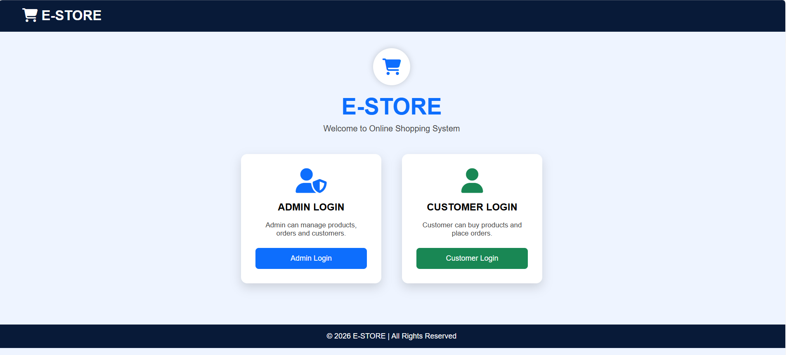
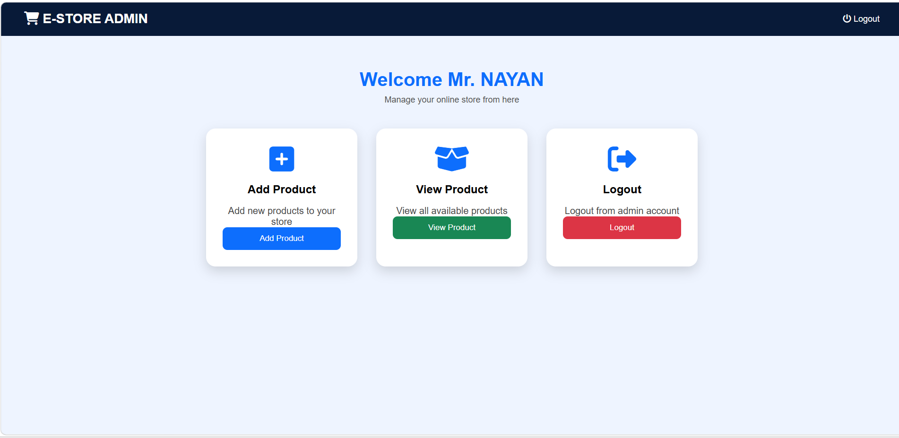
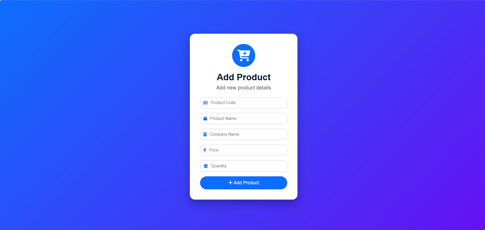
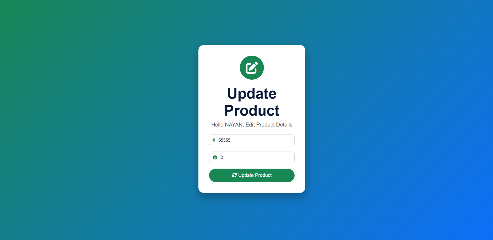
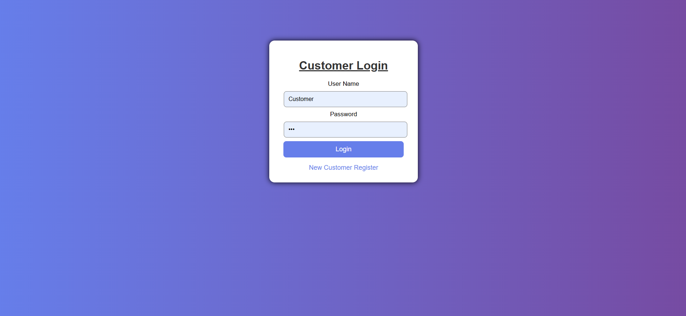
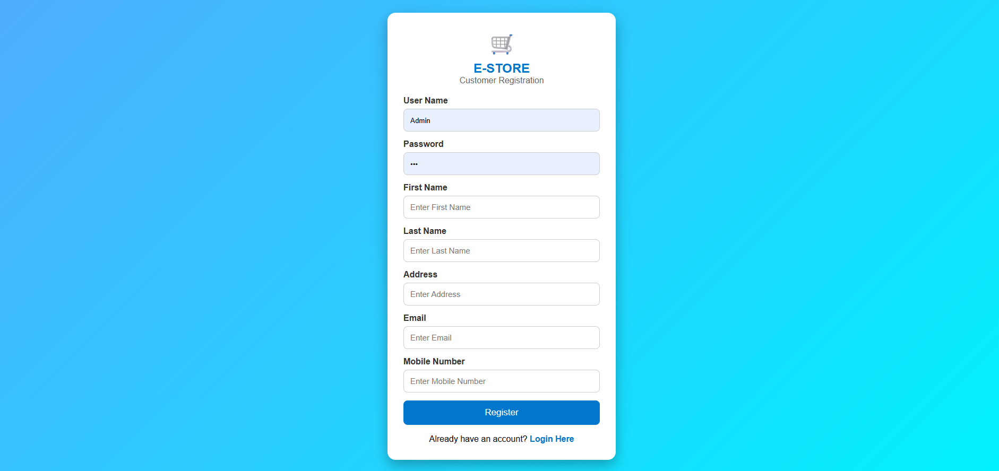
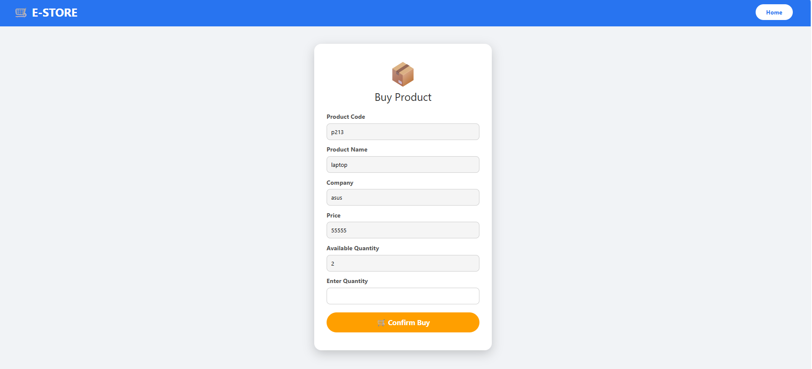
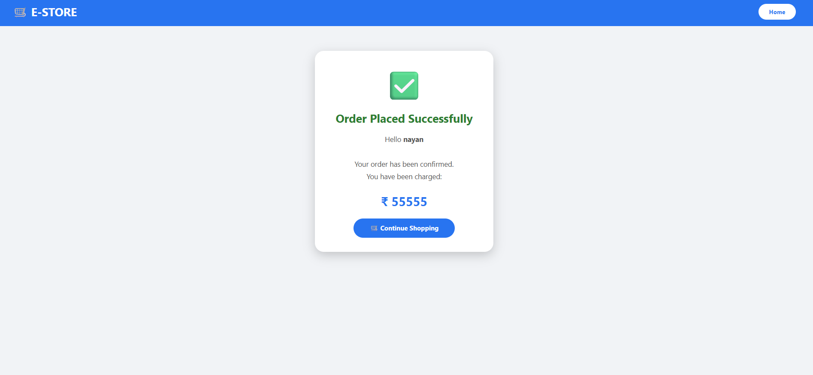

# E-Store - Online Shopping System

## Project Overview
E-Store is a web-based online shopping system developed using Java Enterprise technologies. It allows customers to register, log in, view products, purchase products, and view their order history. The project also includes an admin module for managing products.

## Technologies Used
- Core Java
- Advanced Java (JDBC, Servlets, JSP)
- Oracle Database
- HTML
- CSS
- Apache Tomcat 9
- Eclipse IDE

## Features

### Customer Module
- Customer Registration
- Customer Login
- View Products
- Buy Products
- Order Confirmation
- View Order History
- Logout

### Admin Module
- Admin Login
- Add Product
- View Products
- Update Product
- Delete Product
- Logout

## Database
Main Tables:
- ADMIN
- CUSTOMERS
- PRODUCTSS
- ORDERSS

## Project Structure
```
src/
 ├── Bean
 ├── DAO
 ├── Servlet
WebContent/
 ├── HTML
 ├── JSP
 ├── CSS
 └── Images
```

## Software Required
- JDK 8 or above
- Eclipse IDE
- Apache Tomcat 9
- Oracle Database
- SQL Developer

## How to Run
1. Import the project into Eclipse.
2. Configure Apache Tomcat.
3. Create the required Oracle database tables.
4. Update the database username and password in the DB connection class.
5. Run the project on Tomcat.
6. Open the application in your browser.

## Future Improvements
- Online Payment Integration
- Product Search
- Shopping Cart
- Product Images Upload
- Email Notifications


















## Author

**Nayan Chinchkhede**

BCA Graduate | Java Full Stack Learner

GitHub: https://github.com/your-username
